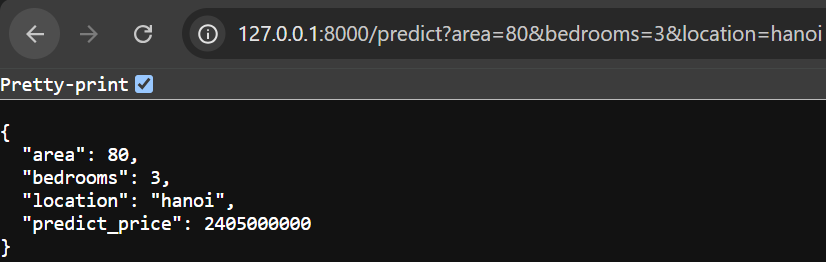

# House Price Prediction Project

## Task 3 Explanations

- **Open http://127.0.0.1:8000/docs, expand /predict, and test it with area=80, bedrooms=3, location=hanoi. Record the returned JSON.**
  

- **Why does calling `/predict` without `location` still work?**
  It works because the `location` parameter is given a default value in the function signature (e.g., `location: str = 'hanoi'`). FastAPI recognizes parameters with default values as optional, so if the client omits it, the server simply uses the default value without throwing an error.
- **Why does calling `/predict` without `area` return a 422 error?**
  Because `area` is defined as `area: float` without any default value. FastAPI treats parameters without defaults as strictly required. When the request is missing a required parameter, FastAPI's built-in validation (via Pydantic) automatically catches the missing data and returns a 422 Unprocessable Entity error.

## Task 5 Explanation

- **Why does a relative URL (`/predict`) work?**
  A relative URL works because the frontend HTML and the backend API are being served by the exact same server and origin (FastAPI on localhost). When the `fetch()` function receives a relative path, the browser automatically prepends the current domain and port (e.g., `http://127.0.0.1:8000`) to the request. This routes it correctly to the backend without needing to hardcode the absolute URL.
